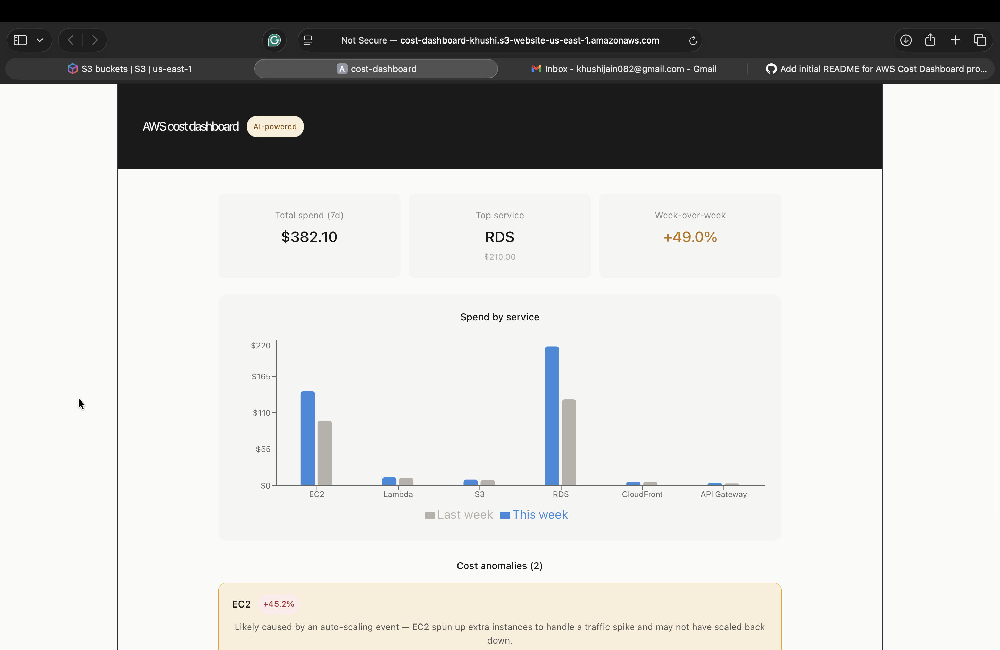

# AWS Cost Dashboard — AI-powered

A full-stack cloud cost monitoring dashboard that uses Claude AI to generate
plain-English explanations for AWS spend anomalies.

## Screenshot


## How it works
1. React frontend fetches AWS spend data via API Gateway
2. Lambda queries the Cost Explorer API and caches results in S3
3. Week-over-week spikes above 20% are sent to Claude API
4. Claude returns a plain-English explanation per anomaly
5. Dashboard displays metric cards, bar chart, and anomaly cards

## Tech stack
- **Frontend:** React, Vite, Recharts, Axios
- **Backend:** AWS Lambda (Node.js 20), API Gateway, S3, Cost Explorer
- **AI:** Anthropic Claude API
- **CI/CD:** GitHub Actions → S3 + CloudFront

## Architecture
React → API Gateway → Lambda → Cost Explorer API
                             ↓
                        Claude API (anomalies only)
                             ↓
                          S3 cache

## Local development
```bash
cd cost-dashboard
npm install
npm run dev
```

Set USE_MOCK = true in both hooks to run without AWS credentials.
